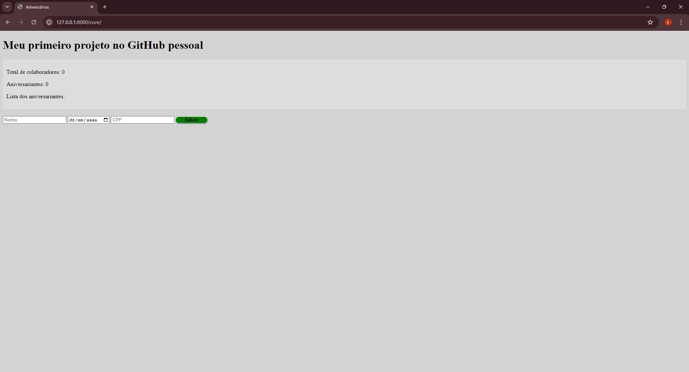

# Site em Django "Aniversário"




> Esta é a tela inicial. O Front End não foi priorizado, pois o objetivo era demonstrar conhecimento em Django.

### Link do vídeo de demonstração no Youtube
https://youtu.be/bryqm4A7oIU?si=jh348WRgz0RbaKn0
### Ajustes e melhorias

O projeto ainda está em desenvolvimento e as próximas atualizações serão voltadas nas seguintes tarefas:

- [x] Criar o site em DJANGO que cadastrar, editar e deletar nomes de colaboradores
- [x] Adicionar os campos: data de nascimento e CPF
- [x] Adicionar contagem de: quantos colaboradores estão cadastrados e quantos fazem aniversário naquele dia.
- [x] Validar CPF e impossibilitar o cadastro de dois CPFs iguais
- [ ] Configurar sistema de login com diferentes niveis de privilégios

## 💻 Pré-requisitos

Por favor verifique o requirements.txt


## 🚀 Instalando Site em Django "Aniversário"

Para instalar o Site em Django "Aniversário", siga estas etapas:

Linux e macOS:

```
bash
git clone https://github.com/BrunoAugustoBignotto/django_aniversario.git
cd django_aniversario
python3 -m venv venv
source venv/bin/activate
pip install -r requirements.txt
```

Windows:

```
git clone https://github.com/BrunoAugustoBignotto/django_aniversario.git
cd django_aniversario
python -m venv venv
venv\Scripts\activate
pip install -r requirements.txt
```

## ☕ Usando Site em Django "Aniversário"

Para usar Site em Django "Aniversário", siga estas etapas:

```
python manage.py runserver
```

Em seguida, abra seu navegador e acesse http://127.0.0.1:8000/core


## 📝 Licença

Esse projeto está sob licença. Veja o arquivo [LICENÇA](LICENSE.md) para mais detalhes.
